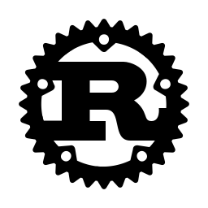

# Welcome to **gyroflaw**

An experienced Software Engineer with over 7 years of experience in Web and Blockchain development.
Strive to follow best practices and use test-driven development in all my projects. Always passionate about programming and am always eager to learn new technologies and trends.

  

<h1 align="center"></h1>

## **Programming Languages ❤️**

<table>
  <tr>
    <td></td>
    <td></td>
    <td></td>
    <td></td>
    <td></td>
    <td></td>
    <td></td>
  </tr>
</table>

## **👍 Experienced Blockchain Networks**

<table>
  <tr>
    <td align="center" width="96">
      
       Ethereum
    </td>
    <td align="center" width="96">
      
       Binance
    </td>
    <td align="center" width="96">
      
       Solana
    </td>
    <td align="center" width="96">
      
       Casper
    </td>    
    <td align="center" width="96">
      
       Polkadot
    </td>
    <td align="center" width="96">
      
       Avalanche
    </td>
    <td align="center" width="96">
      
       Polygon
    </td>
  </tr>
  </table>
